# **Timeless Deck : ¡Es Tiempo! - un juego creado por Nullptr**

## **Enlaces de interés**

Página web : [TimeLess Deck - Es tiempo](https://nullptr23.github.io/TimeLess-Deck-Es-tiempo/)

Release : [Release]()

Vídeo técnico: [Vídeo técnico](https://drive.google.com/file/d/1dgtzYvj6ATE8d7Bw-_a2wKQ2iCqXEsie/view?usp=share_link)

# **Presentaciones**

Hito 0: [Presentación Hito 0](https://drive.google.com/drive/folders/1-1Pm2kTzUgSnDB2sXTowAMRi6hBAmNl6?usp=share_link)

Hito 1: [Presentación Hito 1](https://drive.google.com/drive/folders/1Ych5ag9gQ0Kl-kh5Kt4_yDpjAXTWlqfM?usp=share_link)

Hito 2: [Presentación Hito 2](https://drive.google.com/drive/folders/1qYsZWpWPVjYKSIToGLxZUGzRbRmwNSki?usp=share_link)

# **Arquitectura**

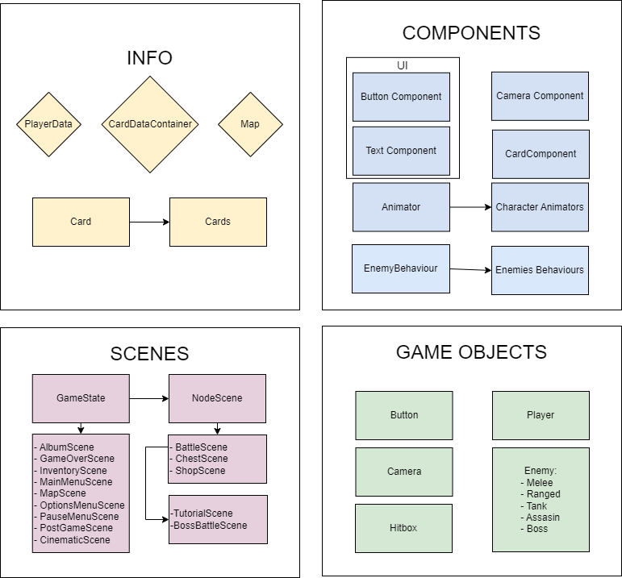</img>

La arquitectura se puede resumir en 4 grandes grupos:
- Información: se encargan de guardar datos utilizados en todos los demás grupos.
- Escenas: se encargan de los estados del juego y contienen las entidades de juego.
- Entidades de juego: contienen sus propios componentes.
- Componentes: se encargan de actualizar datos y comportamientos del objeto al que pertenecen.

# **GDD**

## **Ficha Técnica**

<table>
  <tr>
   <td><strong>Título</strong>
   </td>
   <td>Timeless Deck
   </td>
  </tr>
  <tr>
   <td><strong>PEGI</strong>
   </td>
   <td>12 (non-realistic or non-detailed violence in a fantasy environment)
   </td>
  </tr>
  <tr>
   <td><strong>Género</strong>
   </td>
   <td>Arcade, acción, roguelike, deck builder
   </td>
  </tr>
  <tr>
   <td><strong>Público objetivo</strong>
   </td>
   <td>Jóvenes y adolescentes entre 15 y 25 años
   </td>
  </tr>
  <tr>
   <td><strong>Plataforma</strong>
   </td>
   <td>PC (Windows)
   </td>
  </tr>
  <tr>
   <td><strong>Modos de juego</strong>
   </td>
   <td>Un jugador
   </td>
  </tr>
  <tr>
   <td><strong>Controles</strong>
   </td>
   <td>Teclado + Ratón / Gamepad
   </td>
  </tr>
</table>

## **Descripción**

_Timeless Deck_ es un juego arcade en el cual el jugador deberá superar distintos niveles combatiendo enemigos. Dispondrás de cartas que te servirán de armas; así que, ¡es tiempo de hacerte con todas! 

## **Mecánicas**

**1. Personaje**

El jugador controlará al personaje quien constará de las siguientes mecánicas:
* Movimiento: se podrá mover en dos dimensiones (top-down) hacia cualquier dirección.
* Apuntado: se podrá usar la carta en la dirección deseada apuntando con el ratón o joystick.
* Sistema de vida: se contará con unos puntos de vida (detallados más adelante).
* Sistema de maná: se contará con una cantidad de maná que podrá incrementar durante el juego y se podrá usar para realizar las habilidades de las cartas (detallado más adelante).

**2. Recursos**
1. **Maná**

Permite al jugador usar las habilidades especiales de las cartas. El jugador empezará con una cantidad concreta de maná y solo podrá tener hasta un máximo, el cual puede ser modificado por un objeto (detallada en sus estadísticas más adelante).

Este recurso se obtendrá al matar enemigos (detallado en la sección de enemigos). Los enemigos lo soltarán y lo dejarán en el suelo, teniendo el jugador que recogerlo pasando cerca del mismo, a excepción de si se acaba la oleada, que entonces todo el maná del suelo pasará al jugador automáticamente.

2. **Tiempo**

El tiempo será la moneda del juego que se usará en la tienda para comprar cartas que no tuviera ya el jugador.

Este recurso se obtendrá al completar un nivel, tras hacer un cómputo de los enemigos eliminados, el tiempo transcurrido y el daño recibido en ese nivel.

3. **Éter espacio-temporal**

El éter espacio-temporal será el principal recurso que permitirá al jugador pasar de nivel. El jugador siempre empezará con 0 éter y deberá conseguir la cantidad determinada por cada nivel.

Además, se le proporcionará al jugador automáticamente una vez elimine al enemigo, viéndose reflejado en la carga de la máquina en el HUD (detallado más adelante).

**3. Cartas**

Las cartas son armas que el jugador deberá usar para derrotar a los enemigos. Estas tendrán munición. Cuando se agote la munición, la carta pasará a una pila de descartes. Serán a la vez consumibles que proporcionarán una habilidad especial al jugador.

Por tanto, las cartas consistirán de un ataque y una habilidad: 
* Ataque: puede ser un ataque a distancia (ej: pistola) o un ataque a melee (ej: espada), el cual causará un daño determinado a los enemigos. Además, puede infligir un efecto sobre los enemigos que hayan sido atacados pero no derrotados. Cada uso gasta una unidad de munición.
* Habilidad: puede consistir en un boost temporal de una estadística del jugador o un ataque especial más potente que uno normal. Para usar la habilidad, se debe consumir la carta usando una cantidad de maná determinada y descartándola inmediatamente de la mano. La potencia de la habilidad dependerá de la cantidad de munición restante al consumir la carta: a mayor munición, mayor potencia.

Cada carta estará relacionada con una época: pasado, presente o futuro. Esto influirá en cómo el jugador podrá obtenerlas durante el juego.

**4. Sistema de flujo de cartas**

El jugador comienza con un mazo de 4 cartas predefinido. Como máximo, se podrá tener un límite de 16 cartas en su mazo de combate y nunca podrá llevar menos de 4. Este se podrá modificar en el inventario, antes de seleccionar algún nodo del mapa. 
Al comienzo de un combate, se robarán 4 cartas aleatorias del mazo y estas pasarán a formar parte de la mano, las cuales se usarán para el combate. Se van usando las cartas y, una vez consumidos todos los usos de una carta, esta es descartada y va a la pila de descartes. Cuando el jugador se queda sin cartas en la mano, roba 4 cartas del mazo. Si se intenta robar de un mazo vacío, la pila de descartes se baraja, se vuelve a colocar en el lugar del mazo y el jugador roba de este. 
 
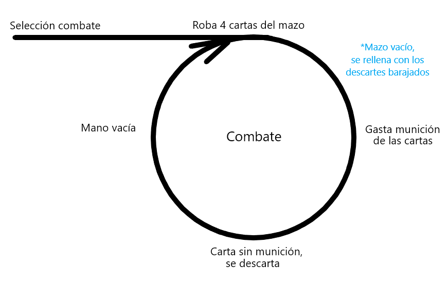</img>

**5. Objetos pasivos (Reliquias)**

Los objetos pasivos proporcionarán un aumento permanente a las estadísticas del jugador para el resto de la partida. Siempre será menor que un aumento temporal proporcionado por una habilidad de una carta.

Estos se podrán obtener de manera aleatoria en los cofres del mundo. Durante una partida no aparecerá dos veces el mismo objeto.

**6. Enemigos**

Los enemigos son el principal peligro al que se enfrentará el jugador. Acabar con ellos será esencial para poder cargar la máquina (terminar el nivel) y usar habilidades. 

Habrá 4 tipos de enemigos: los TANQUES (T), los LUCHADORES (L), los TIRADORES (R) y los ASESINOS (A). Estos serán los mismos para el resto del juego, pero irán variando en aspecto y fuerza según lo avanzado del nivel y la época en la que se encuentre el jugador. Compartirán las siguientes mecánicas:
* Movimiento: top-down con patrones de movimiento diferentes por enemigo.
* Ataque: cuerpo a cuerpo o a distancia con diferentes patrones según el enemigo.
* Muerte: los enemigos al morir, dependiendo de qué tipo sean, soltarán cierta cantidad de maná al suelo que podrá ser recogida por el jugador. Además, al morir, estos proporcionarán éter espacio-temporal que contribuirá a la carga de la máquina del tiempo, permitiendo al jugador completar el nivel.

Sus comportamientos serán distintos para cada tipo:
* Tanque: avanza hacia el jugador, pudiendo atacar cuerpo a cuerpo o en un área corta.
* Luchador: avanza hacia el jugador con la intención de colisionar con él, atacando cuerpo a cuerpo.
* Tirador: avanza hacia el jugador pero mantiene las distancias de forma que pueda atacar al jugador con proyectiles a distancia.
* Asesino: avanza hacia el jugador con la intención de dashear hacia él, atacando cuerpo a cuerpo y esquiva las balas del jugador con dicho dash también.

Las estadísticas y características de los enemigos se explican más adelante.

**7. Mundo y nodos**

La navegación entre las diferentes fases de juego se llevará a cabo a través de un mapa de nodos. Este se generará con nodos interconectados aleatoriamente al comienzo de cada partida, pero siempre cumplirá ciertos parámetros.

La navegación de este mapa será en un único sentido, por lo que no se podrá retroceder en ningún momento. Las distintas ramas llevarán al mismo nodo final: la batalla contra el jefe final **_El Guardián del Tiempo_**. 

Los tipos de nodos (fases de juego) son:
* Nodos de combate: cada uno está ubicado en un momento temporal diferente: pasado, presente o futuro. Esto condiciona los tipos de enemigos que aparecerán y las recompensas que el jugador obtendrá. El jugador deberá vencer enemigos para ir llenando el medidor de la máquina del tiempo. Cuando se llene, se dará la posibilidad de abrir un portal para salir del nivel. El jugador no tiene porqué entrar en este directamente, pero la dificultad del nivel se elevará de forma exponencial si decide seguir en el nivel. Al completar el nivel, el jugador volverá al mapa de nodos para elegir su próximo destino.
* Nodos de tienda: se le ofrecerán al jugador 4 cartas que no tenga ya en su inventario. Se garantiza al menos una carta de futuro, una de presente y una de pasado. La cuarta carta será aleatoria. Cada carta tendrá un precio asociado. El jugador podrá, si se lo puede permitir, comprar hasta las 4 cartas ofertadas en cada tienda.
* Nodos de cofre: el jugador abrirá un cofre en el que encontrará un objeto que le otorgará beneficios pasivos de forma aleatoria.
* Nodo del **_Guardián del Tiempo_**: Batalla contra el jefe final. Si se le consigue derrotar se obtendrá el final del juego.  

## **Dinámicas**

### **1. Bucle de juego**

El bucle de juego consistirá en ir superando niveles donde se debe matar enemigos usando cartas para completarlos, de forma que al terminar se consiga una cantidad de oro como recompensa, la cual servirá para comprar más cartas en tiendas. También se debe completar niveles para tener la posibilidad de acceder a cofres, los cuales darán objetos pasivos que aumentarán las estadísticas permanentemente. Tiene dos profundidades:

1. **Mapa del mundo:**

Desde donde empieza el juego y a donde se volverá siempre tras finalizar cada nodo. Aquí, se puede elegir a qué nodo desplazarse de los que tiene disponibles y acceder a su inventario donde se puede preparar el mazo para el combate.

2. **Combate**

En esta fase, el jugador tomará control del personaje principal dentro de una gran sala rectangular y plana. Se intentará derrotar a un cierto número de enemigos para reparar la máquina del tiempo y así tener la opción de salir del combate.

### **2. Sistema de economía** 

Durante el juego, al derrotar enemigos, ganarás monedas que sirven para gastar en la tienda.

Este oro se otorgará al final del combate y se entregará en una cantidad dependiente de los enemigos derrotados, el tiempo utilizado (solo se cuenta el usado para llenar el portal) y los golpes recibidos de forma que es directamente proporcional a lo primero e inversamente proporcional a los dos últimos factores.

### **3. Sistema de cartas** 

Existe la posibilidad de gestionar un inventario con cartas para crear un mazo con el cual se jugará durante las diferentes batallas. Además durante las batallas, se podrán ir escogiendo de una mano la carta a usar en el momento principalmente con las teclas numéricas del teclado o con los _shoulders_ o _directional pad_ del mando.
Al terminar las batallas se recompensa al jugador con más cartas. En las batallas impares del mapa se obtendrá una unidad de carta de un tipo nuevo que no tengas en el mazo, y en la siguiente batalla se obtendrán 2 copias de esa misma carta (llegando a recibir 3 copias de un nuevo tipo de carta cada 2 batallas completadas).

### **4. Sistema de estadísticas** 

El jugador cuenta con unas estadísticas que hacen referencia a valores como el daño que hace o la velocidad de movimiento entre otros (explicadas con más detalle más adelante). Estas estadísticas se pueden mejorar mediante unos objetos que se consiguen en el mapa, más concretamente en los nodos de cofre: las reliquias. Como mucho, el jugador podrá recibir hasta 6 objetos de este tipo que a lo sumo, le duplicarán el valor de sus estadísticas.

# **Interfaz**

A continuación se especificarán las características de los menús e interfaces presentes en el juego. Se hará siguiendo el bucle de juego.

**1. Menú principal**

El menú es claro y sencillo. Incluirá el título del juego y el nombre del estudio así como 4 botones: Jugar, Salir, Opciones y Albúm.

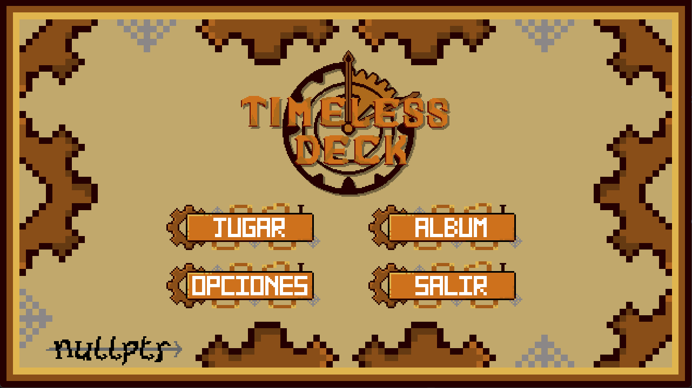</img>

Si hay una partida guardada, aparecerá la opción de cargarla.

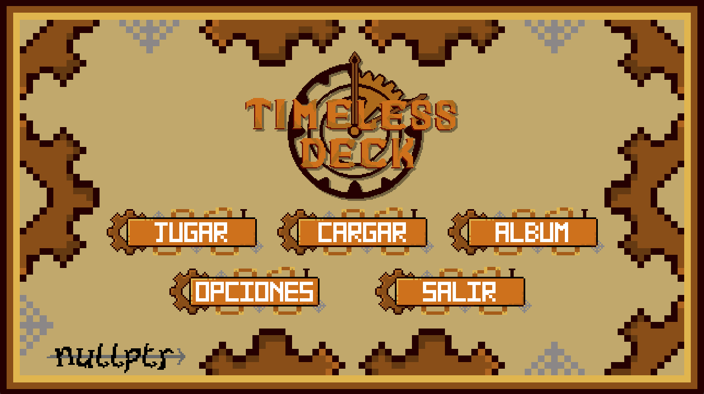</img>

**2. Opciones**

En este menú, el jugador podrá cambiar los controles y ajustar el volumen a su gusto. Cuenta con una imagen donde se detallarán los controles y cada uno con dos botones para cambiar la opción indicada.

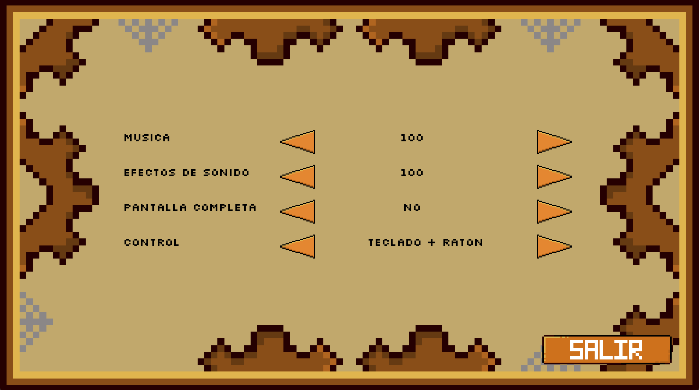</img>

**3. Albúm**

Espacio donde se podrán encontrar las características de las cartas encontradas en las diferentes sesiones de juego. Se podrán visualizar de manera general todas y, para observarlas con más detalle, hará falta seleccionarlas.

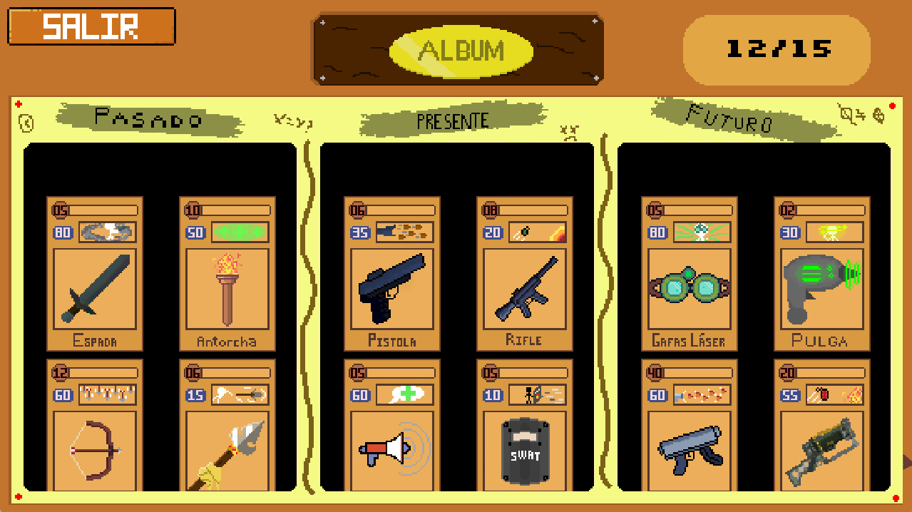</img>

**4. Tutorial** 

Al darle al botón de _JUGAR_ entraremos al tutorial donde se explicarán los conocimientos básicos para poder disfrutar del juego.

</img>

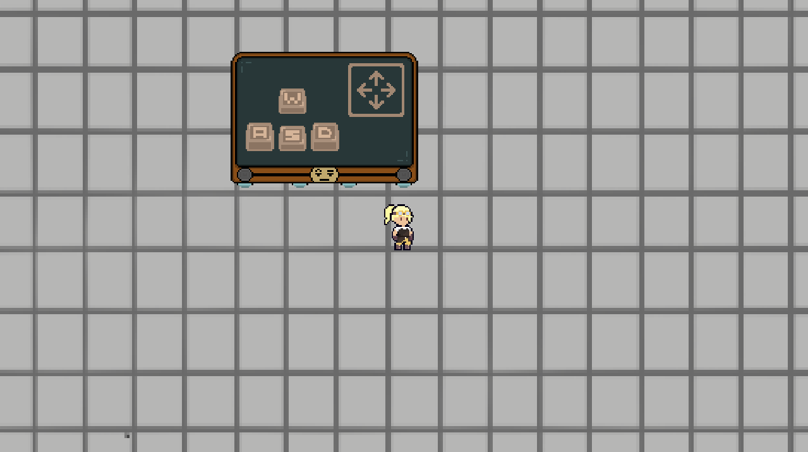</img>

**5. Bucle de juego** 

Tras pasarnos el tutorial, se generará un mapa aleatorio y se le presentará de la misma manera que en la imagen siguiente. Contiene 3 botones: uno para salir al menú principal, otro del Inventario del jugador y por último, el de opciones.

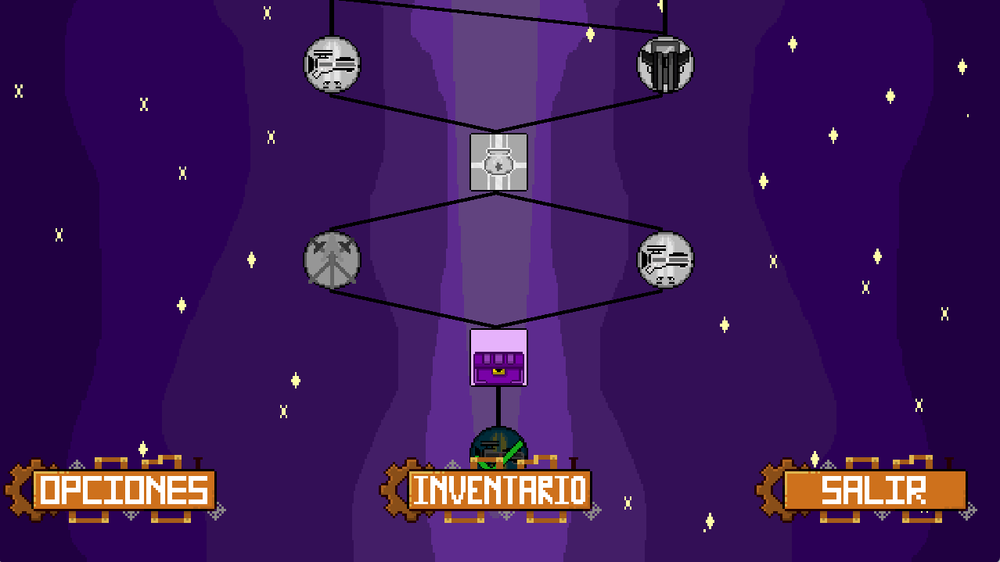</img>

**6. Inventario** 

En esta sección el jugador podrá observar los objetos encontrados, su cantidad de Tiempo actual (monedas actuales), sus estadísticas ya modificadas por los objetos y gestionar el mazo de juego de cada batalla.
Podemos observar todos los elementos en la siguiente imagen donde la sección amarilla corresponde al inventario y la rojiza al mazo.

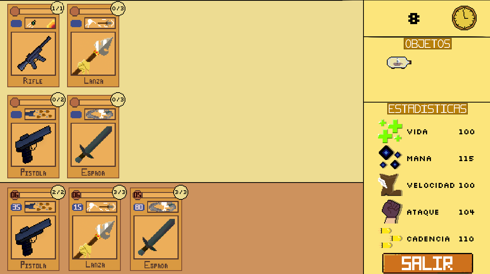</img>

**7. Combate (HUD)**

Durante el combate el HUD mostrará:
* Maná: se mostrará una barra en la zona central superior izquierda con la cantidad de maná del jugador durante la partida.
* Carga de la máquina: se mostrará la carga en un círculo que se irá rellenando en la zona central superior durante la partida.
* Vida: se mostrará una barra en la zona superior central derecha con la vida actual del jugador.
* Mazo: se mostrará el mazo en la esquina inferior izquierda.
* Mano: se mostrarán en la zona inferior central las cartas de la mano. La seleccionada sobresaldrá más que el resto (ver imagen).
* Descarte: se mostrará la pila de descartes en la esquina inferior derecha.

</img>

**8. Post-Combate**

Una pantalla que contiene las estadísticas durante la batalla: los enemigos derrotados, la vida perdida, el tiempo empleado, el dinero obtenido; y la obtención de nuevas cartas.

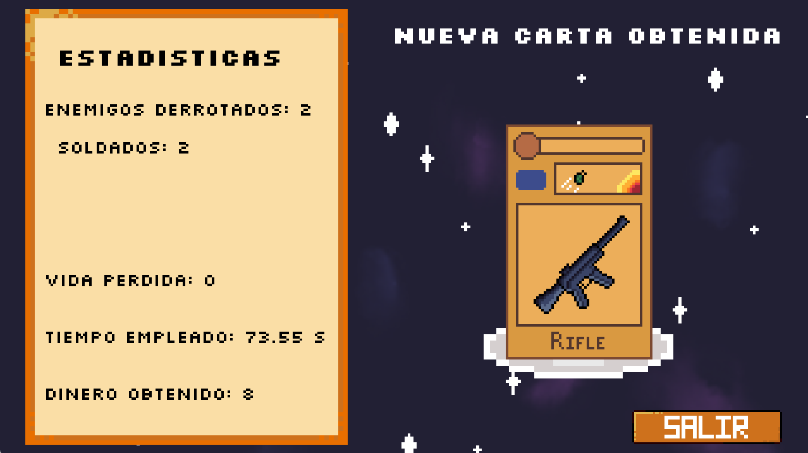</img>

</img>

**9. Pausa**

El jugador podrá pausar el juego cuando esté en una batalla. En esta pantalla tendrá la oportunidad de ver su inventario, los controles y acceso a las opciones. Existirá también un botón que permitirá salir al menú principal y guardar el estado de la sesión de juego para que la próxima vez el jugador pueda continuar donde lo dejó.

</img>

**10. Tienda**

Lugar donde el jugador podrá hacerse con hasta 4 nuevas cartas (una del pasado, una del presente, una del futuro y otra escogida al azar). El jugador podrá ver cuánto Tiempo tiene para poder comprar las cartas. Se podrán seleccionar las cartas para observar sus precios y se podrá clicar sobre el botón de _COMPRAR_ para efectuar la acción. Para acabar la fase de compra el jugador ha de clicar sobre el botón de _SALIR_.

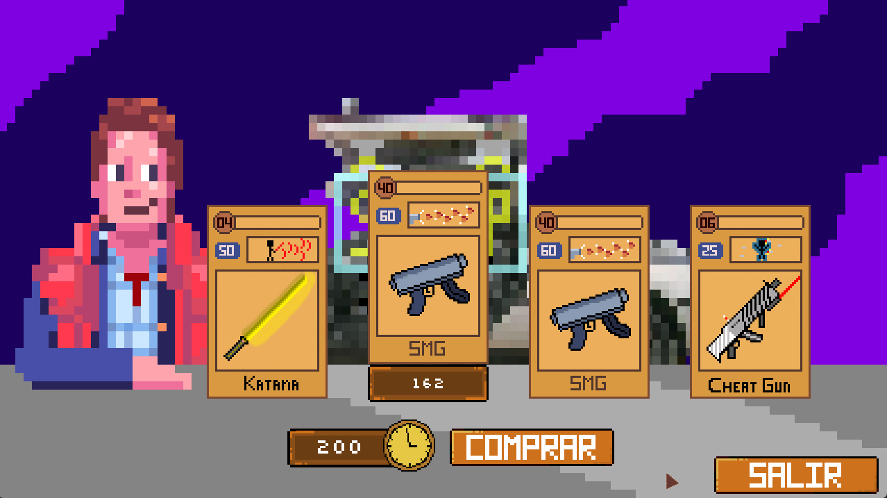</img>

**11. Cofre**

Aquí se entregará un objeto pasivo aleatorio al jugador. El jugador verá los atributos del objeto que le ha tocado. Tras esto, para avanzar al mapa debe seleccionar el botón _SALIR_.

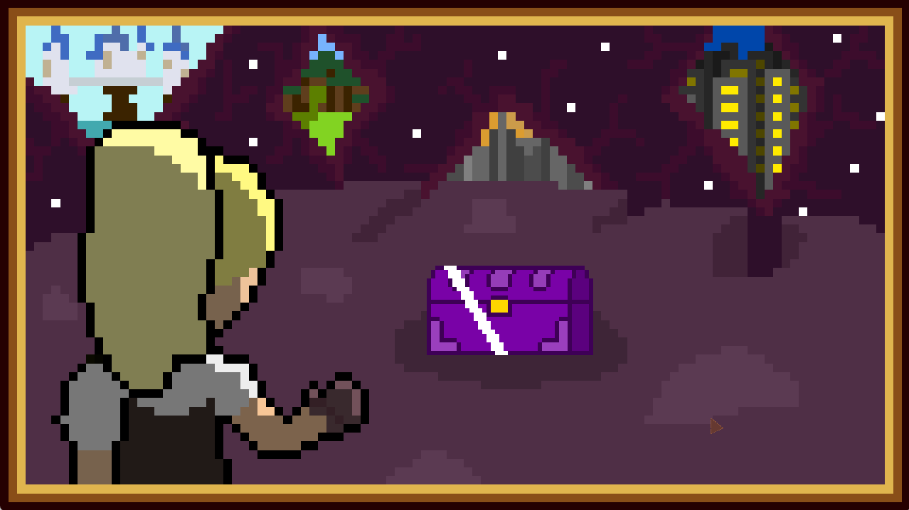</img>

</img>

## **Estadísticas**

**1. Personaje**

<table>
  <tr>
   <td><strong>Vida</strong>
   </td>
   <td>El máximo HP con el que se empieza cada combate

100 puntos de salud
   </td>
  </tr>
  <tr>
   <td><strong>Velocidad de movimiento</strong>
   </td>
   <td>La velocidad base con la que se empieza cada combate

100 unidades de velocidad
   </td>
  </tr>
  <tr>
   <td><strong>Ataque</strong>
   </td>
   <td>El daño base con la que se empieza cada combate sin importar si es ataque melee o a distancia
   </td>
  </tr>
  <tr>
   <td><strong>Velocidad de ataque</strong>
   </td>
   <td>La rapidez de ataque base del jugador con cualquier arma

1 atq/s
   </td>
  </tr>
  <tr>
   <td><strong>Maná</strong>
   </td>
   <td>La cantidad de maná máximo que puede tener el personaje

100 puntos de maná
   </td>
  </tr>
</table>

**2. Enemigos**

<table>
  <tr>
   <td colspan="2" ><strong>Tanques</strong>
   </td>
  </tr>
  <tr>
   <td><strong>Vida</strong>
   </td>
   <td>60
   </td>
  </tr>
  <tr>
   <td><strong>Ataque</strong>
   </td>
   <td>Ataque a corta distancia.

Harán daño al jugador tanto por contacto como realizando un ataque en una pequeña área delante de él.
   </td>
  </tr>
  <tr>
   <td><strong>Vel. mov</strong>
   </td>
   <td>70 unidades de velocidad
   </td>
  </tr>
  <tr>
   <td><strong>Vel. ataq</strong>
   </td>
   <td>Lenta
   </td>
  </tr>
  <tr>
   <td><strong>Maná</strong>
   </td>
   <td>40
   </td>
  </tr>
  <tr>
   <td><strong>Carga máq.</strong>
   </td>
   <td>20
   </td>
  </tr>
  <tr>
   <td colspan="2" ><strong>Luchadores</strong>
   </td>
  </tr>
  <tr>
   <td><strong>Vida</strong>
   </td>
   <td>30
   </td>
  </tr>
  <tr>
   <td><strong>Ataque</strong>
   </td>
   <td>Ataque cuerpo a cuerpo.

Harán daño al jugador únicamente por contacto.
   </td>
  </tr>
  <tr>
   <td><strong>Vel. mov</strong>
   </td>
   <td>100 unidades de velocidad
   </td>
  </tr>
  <tr>
   <td><strong>Vel. ataq</strong>
   </td>
   <td>Rápida
   </td>
  </tr>
  <tr>
   <td><strong>Maná</strong>
   </td>
   <td>10
   </td>
  </tr>
  <tr>
   <td><strong>Carga máq.</strong>
   </td>
   <td>5
   </td>
  </tr>
  <tr>
   <td colspan="2" ><strong>Tiradores</strong>
   </td>
  </tr>
  <tr>
   <td><strong>Vida</strong>
   </td>
   <td>20
   </td>
  </tr>
  <tr>
   <td><strong>Ataque</strong>
   </td>
   <td>Ataque a distancia.

Harán daño al jugador con proyectiles disparados desde lejos.
   </td>
  </tr>
  <tr>
   <td><strong>Vel. mov</strong>
   </td>
   <td>90 unidades de velocidad
   </td>
  </tr>
  <tr>
   <td><strong>Vel. ataq</strong>
   </td>
   <td>Media
   </td>
  </tr>
  <tr>
   <td><strong>Maná</strong>
   </td>
   <td>20
   </td>
  </tr>
  <tr>
   <td><strong>Carga maq.</strong>
   </td>
   <td>10
   </td>
  </tr>
</table>

## **Objetos**

**1. Cartas**

**Cartas de tiempo Pasado**
<table>
  <tr>
   <td rowspan="2" ><strong>Imagen</strong>
   </td>
   <td rowspan="2" ><strong>Nombre</strong>
   </td>
   <td rowspan="2" ><strong>Uso</strong>
   </td>
   <td rowspan="2" ><strong>Habilidad</strong>
   </td>
  </tr>
  <tr>
  </tr>
  <tr>
   <td>

   </td>
   <td>Espada
   </td>
   <td>Crea una zona de daño frente al jugador

Límite: 5
   </td>
   <td>Genera un área amplia y dañina alrededor del jugador

Gasto de maná: 80
   </td>
  </tr>
  <tr>
   <td>
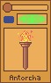

   </td>
   <td>Antorcha
   </td>
   <td>Inflige daño y quema a los enemigos en una zona creada frente al jugador

Límite: 10
   </td>
   <td>Genera una zona de curación para el jugador

Gasto de maná: 50
   </td>
  </tr>
  <tr>
   <td>

   </td>
   <td>Arco
   </td>
   <td>Lanza una flecha en la dirección que apunta el jugador

Límite: 6
   </td>
   <td>Genera un área dañina a cierta distancia del jugador en la dirección en la que apunta

Gasto de maná: 60
   </td>
  </tr>
  <tr>
   <td>
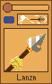

   </td>
   <td>Lanza
   </td>
   <td>Crea un área dañina estrecha en la dirección que apunta el jugador

Límite: 6
   </td>
   <td>Lanza un proyectil en línea recta que atraviesa a todos los enemigos en su trayectoria

Gasto de maná: 15
   </td>
  </tr>
  <tr>
   <td>
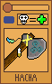

   </td>
   <td>Hacha Ritual
   </td>
   <td>Inflige daño a los enemigos en una zona creada en la dirección a la que apunta el jugador

Límite: 5
   </td>
   <td>Te cura una parte de tu vida según cuantos enemigos hayas matado con este arma

Gasto de maná: 35
   </td>
  </tr>
</table>

**Cartas de tiempo Presente**
<table>
  <tr>
   <td rowspan="2" ><strong>Imagen</strong>
   </td>
   <td rowspan="2" ><strong>Nombre</strong>
   </td>
   <td rowspan="2" ><strong>Uso</strong>
   </td>
   <td rowspan="2" ><strong>Habilidad</strong>
   </td>
  </tr>
  <tr>
  </tr>
  <tr>
   <td>

   </td>
   <td>Pistola
   </td>
   <td>Lanza un proyectil normal

Límite: 6
   </td>
   <td>Lanza los proyectiles restantes en arco

Gasto de maná: 35
   </td>
  </tr>
  <tr>
   <td>

   </td>
   <td>SMG
   </td>
   <td>Lanza proyectiles normales con una cadencia aumentada

Límite: 40
   </td>
   <td>Aumenta aún más la cadencia del arma y dispara los usos restantes

Gasto de maná: 60
   </td>
  </tr>
  <tr>
   <td>

   </td>
   <td>Rifle de asalto
   </td>
   <td>Dispara ráfagas de cuatro balas

Límite: 6
   </td>
   <td>Lanza una granada que tras pocos segundos explotará haciendo daño en un área determinada

Gasto de maná: 25
   </td>
  </tr>
  <tr>
   <td>

   </td>
   <td>Megáfono
   </td>
   <td>Crea una sucesión de ondas dañinas que infligen más daño cuanto más cerca del jugador se está

Límite: 5
   </td>
   <td>Cura al jugador una parte de su salud

Gasto de maná: 60
   </td>
  </tr>
  <tr>
   <td>

   </td>
   <td>Escudo Antidisturbios
   </td>
   <td>Inflige daño a enemigos presentes en una zona creada frente al jugador

Límite: 5
   </td>
   <td>Crea un escudo que bloquea ataques y proyectiles

Gasto de maná: 30
   </td>
  </tr>
</table>

**Cartas de tiempo Futuro**
<table>
  <tr>
   <td rowspan="2" ><strong>Imagen</strong>
   </td>
   <td rowspan="2" ><strong>Nombre</strong>
   </td>
   <td rowspan="2" ><strong>Uso</strong>
   </td>
   <td rowspan="2" ><strong>Habilidad</strong>
   </td>
  </tr>
  <tr>
  </tr>
  <tr>
   <td>

   </td>
   <td>Gafas Láser
   </td>
   <td>Dispara dos proyectiles láser que atraviesan a los enemigos

Límite: 5
   </td>
   <td>Crea una bola de rayos que avanzará lentamente realizando daño a aquello que encuentre

Gasto de maná: 80
   </td>
  </tr>
  <tr>
   <td>

   </td>
   <td>Pulga
   </td>
   <td>Lanza proyectiles pequeños que generan un área dañina al explotar

Límite: 2
   </td>
   <td>Confunde a los enemigos cercanos para que se muevan y disparen de forma errática

Gasto de maná: 30
   </td>
  </tr>
  <tr>
   <td>

   </td>
   <td>Rifle de luz
   </td>
   <td>Dispara proyectiles normales

Límite: 20
   </td>
   <td>Lanza una granada que tras pocos segundos se activará quemando a los enemigos presentes en su área de explosión

Gasto de maná: 55
   </td>
  </tr>
  <tr>
   <td>
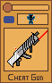

   </td>
   <td>CheatGun
   </td>
   <td>Dispara proyectiles que se dirigirán al enemigo más cercano

Límite: 6
   </td>
   <td>Le concede al jugador una invulnerabilidad temporal

Gasto de maná: 25
   </td>
  </tr>
  <tr>
   <td>

   </td>
   <td>Katana Láser
   </td>
   <td> Impulsa al jugador hacia la dirección en la que estuviera apuntando creando una zona de daño en la zona recorrida

Límite: 4
   </td>
   <td>Crea tantas zonas dañinas como usos queden que avanzan en línea recta dañando todo a su paso

Gasto de maná: 50
   </td>
  </tr>
</table>

**2. Reliquias**

<table>
  <tr>
   <td rowspan="2" ><strong>Nombre</strong>
   </td>
   <td colspan="5" ><strong>Mejora</strong>
   </td>
   <td rowspan="2" ><strong>Época</strong>
   </td>
  </tr>
  <tr>
   <td><strong>Vida</strong>
   </td>
   <td><strong>Velocidad de movimiento</strong>
   </td>
   <td><strong>Cadencia</strong>
   </td>
   <td><strong>Maná</strong>
   </td>
   <td><strong>Ataque</strong>
   </td>
  </tr>
  <tr>
   <td><strong>Inicial</strong>
   </td>
   <td><strong>100</strong>
   </td>
   <td><strong>100</strong>
   </td>
   <td><strong>70</strong>
   </td>
   <td><strong>100</strong>
   </td>
   <td><strong>100</strong>
   </td>
   <td>
   </td>
  </tr>
  <tr>
   <td>Almacenamiento

cuantico
   </td>
   <td>10
   </td>
   <td>0
   </td>
   <td>0
   </td>
   <td>20
   </td>
   <td>0
   </td>
   <td>Futuro
   </td>
  </tr>
  <tr>
   <td>Hoverboard
   </td>
   <td>0
   </td>
   <td>25
   </td>
   <td>0
   </td>
   <td>20
   </td>
   <td>0
   </td>
   <td>Futuro
   </td>
  </tr>
  <tr>
   <td>Engranaje áureo
   </td>
   <td>10
   </td>
   <td>10
   </td>
   <td>10
   </td>
   <td>10
   </td>
   <td>10
   </td>
   <td>Futuro
   </td>
  </tr>
  <tr>
   <td>Brazalete de iones
   </td>
   <td>20
   </td>
   <td>10
   </td>
   <td>0
   </td>
   <td>0
   </td>
   <td>0
   </td>
   <td>Futuro
   </td>
  </tr>
  <tr>
   <td>Regalo
   </td>
   <td>10
   </td>
   <td>0
   </td>
   <td>20
   </td>
   <td>0
   </td>
   <td>25
   </td>
   <td>Presente
   </td>
  </tr>
  <tr>
   <td>Reloj Digital
   </td>
   <td>10
   </td>
   <td>25
   </td>
   <td>0
   </td>
   <td>0
   </td>
   <td>0
   </td>
   <td>Presente
   </td>
  </tr>
  <tr>
   <td>Collar gótico
   </td>
   <td>10
   </td>
   <td>0
   </td>
   <td>0
   </td>
   <td>0
   </td>
   <td>20
   </td>
   <td>Presente
   </td>
  </tr>
  <tr>
   <td>Cinturón de herramientas
   </td>
   <td>0
   </td>
   <td>0
   </td>
   <td>15
   </td>
   <td>15
   </td>
   <td>0
   </td>
   <td>Presente
   </td>
  </tr>
  <tr>
   <td>Cetro papal
   </td>
   <td>15
   </td>
   <td>0
   </td>
   <td>0
   </td>
   <td>0
   </td>
   <td>30
   </td>
   <td>Pasado
   </td>
  </tr>
  <tr>
   <td>Libro Perdido
   </td>
   <td>0
   </td>
   <td>0
   </td>
   <td>0
   </td>
   <td>20
   </td>
   <td>10
   </td>
   <td>Pasado
   </td>
  </tr>
  <tr>
   <td>Taza de café
   </td>
   <td>15
   </td>
   <td>30
   </td>
   <td>15
   </td>
   <td>0
   </td>
   <td>0
   </td>
   <td>Pasado
   </td>
  </tr>
  <tr>
   <td>Botella con un barco en miniatura
   </td>
   <td>0
   </td>
   <td>0
   </td>
   <td>10
   </td>
   <td>15
   </td>
   <td>5
   </td>
   <td>Pasado
   </td>
  </tr>
</table>

## **Arte**

**1.  Estética**

Se seguirá una temática principal steampunk en el diseño principal del personaje y de los diferentes HUDs existentes.

**2. Historia**

La protagonista es una joven científica, una prodigio de su tiempo. 

Esta científica perdió a su esposa por una enfermedad para la que no había cura entonces y la pena de su pérdida le llevó a la idea de construir una máquina del tiempo para verla una última vez, ya que al terminar la máquina, la realidad desaparecerá a causa de las infinitas paradojas que esto generaría.

Esto ya se ha intentado en más ocasiones, pero solo destacan 2 personas por sobrevivir, una en 1494, por Leonardo Da Vinci, y otra por Marty McFly en 2552, pero fracasaron y se quedaron atrapados en esta dimensión, dejando rastros de su tiempo.

Ahora se dedican a vender cartas que encuentran o inventan a las pobres almas que cometen el error de intentar lo mismo para sobrevivir.

Es por esto que el guardián del tiempo, un horror cósmico de tres ojos, los cuales ven el pasado, presente y futuro, llamado Kronón lleva a la protagonista y su máquina imperfecta a su dimensión en la que el tiempo está entremezclado y no tiene sentido para evitar que la termine, pero la científica usará todo lo que esté en su mano para terminar la máquina.

Al llegar a Kronón y derrotar a este, la protagonista le quitará un ojo y la máquina del tiempo se sobrecargará, sacándola de esta dimensión a la realidad y destruyéndose en el proceso, por lo que tendrá que reconstruirla, lo que le llevará tiempo (envejecerá). Tiene que repetir este proceso dos veces más para conseguir todos los ojos y que la máquina se pueda controlar, siendo totalmente operativa y logrando el objetivo de la protagonista.

Las cartas son un invento del futuro que materializan armas y permiten usar habilidades o dar beneficios superhumanos.

**Reglas temporales (nuestras):**
* El tiempo NO DEBE ser alterado, por ello existe _Kronón_ el guardián del tiempo. Al ser el guardián no puede eliminar a la protagonista de la historia matando a ningún antepasado, y por la misma razón, cada persona que entra en la dimensión de _Kronón_ sale de ella en el mismo momento de la historia del que se fue.
* En la dimensión de _Kronón_ el tiempo es estable, no avanza. Por ello la protagonista no sufre ningún cambio físico aunque esté atrapada mucho tiempo.
* No pueden existir 2 versiones de la misma persona a la vez en el tiempo, de ahí que se intente evitar la creación de la máquina del tiempo. Esto crea una paradoja, y esta hará colapsar el universo.

**3. Paleta de colores**

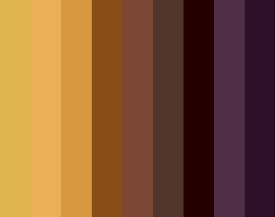</img>

**4. Bocetos**

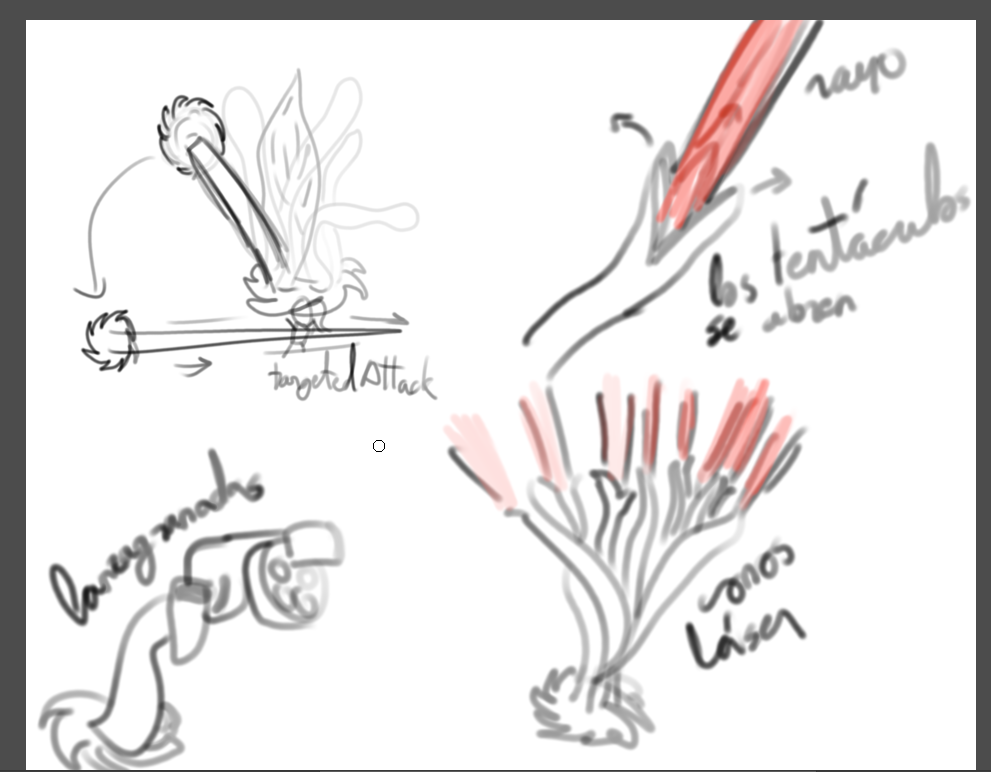</img>
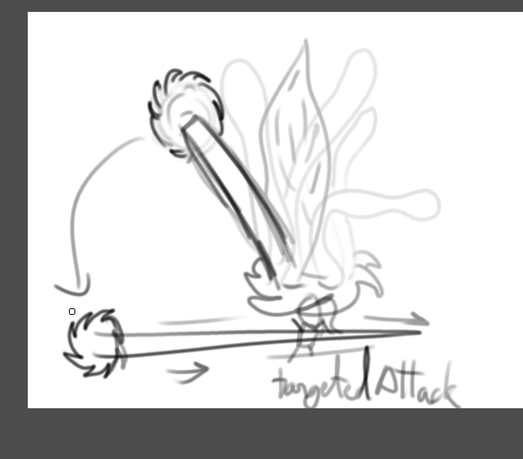</img>
</img>
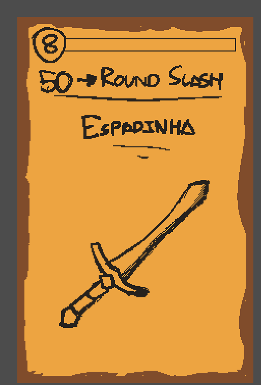</img>
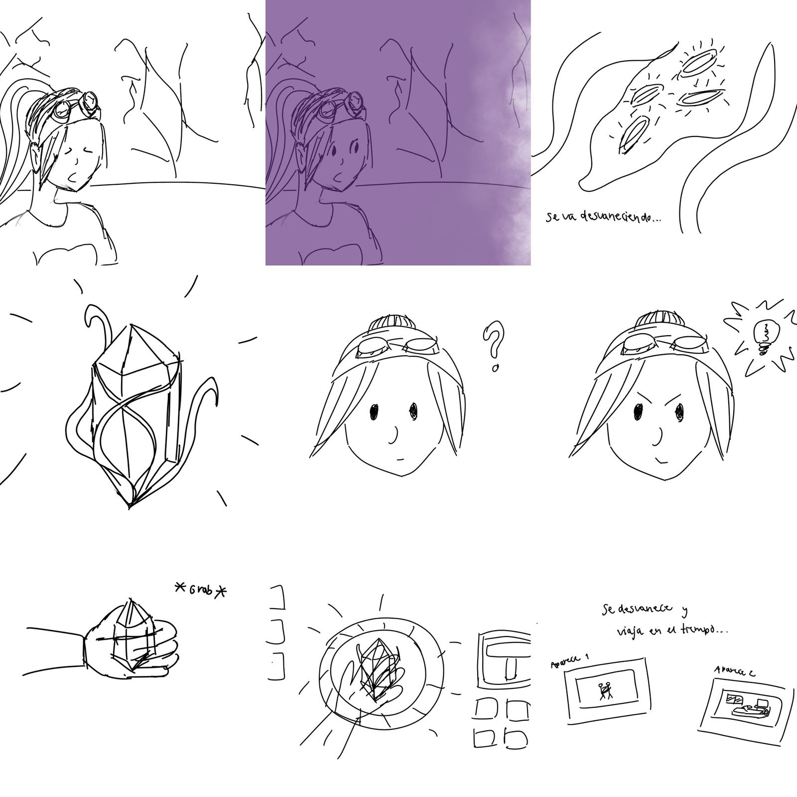</img>

## **Balanceo**

* **Espada**
    *     Daño de ataque: 

            	  20 => 15

    *     Tiempo entre disparos:

                0.5s => 0.75s

    *     Rango:

                200 => 120

* **Antorcha**
   *    Daño de ataque: 

        		  20 => 5

   *     Rango:

               200 => 120

   *     Curación de la habilidad:

        		  5 cada 0.5s => 1 cada 0.2s

* **Lanza**
   *     Rango:

               100 => 120

* **Gafas Laser**
    *     Ataque: 

         	    Ahora lanza 2 proyectiles en lugar de 1

    *     Daño de ataque: 

                10 => 5 (para que el daño total se mantenga)

* **Arco**
    *     Ataque: 

         	    Ahora lanza 3 proyectiles en lugar de 1

    *     Daño de ataque: 

                15 => 7

    *     Usos máximos: 

                12 => 6

    *     Tiempo entre disparos: 

                0.5s => 0.75s

* **Pulga**
   *     Daño de ataque: 

        		  30 => 20

* **SMG**
   *     Daño de ataque: 

        		  3 => 5

   *     Tiempo entre disparos: 

       			  0.3s = 0.2s

* **Rifle**
   *     Habilidad

			  La granada de la habilidad explota antes (2s => 1s)

   *     Daño de ataque: 

       		  5 => 4 (por bala)

   *     Usos máximos: 

              8 => 6

   *     Tiempo entre disparos:

              0.8s => 1s

   *     Maná:

              20 => 25

* **Bláster**
   *     Tiempo entre disparos:

       		  0.2s => 0.3s

* **Megáfono**
   *     Ataque: 

              Ahora cada hitbox no se rompe al chocar con un enemigo

   *     Daño de ataque: 

              7 => 5

* **Escudo Antidisturbios**
   *     Habilidad: 

    			El escudo se mantiene en el sitio

   *     Maná:

       			10 => 30

* **Hacha Ritual**
   *     Daño de ataque:

      			2 => 5

   *     Rango:

      			200 => 120

* **Laser Katana**
   *     Daño de habilidad:

      			20 => 5 (Por onda)

## **Inspiraciones**
1. _The Binding of Isaac._ (2014) Nicalis Inc.
2. _Brotato._ (2022) Blobfish.
3. _Vampire Survivors._ (2022) Poncle.
4. _Slay the Spire._ (2019) Mega Crit Games.
5. _Neon White._ (2022) Annapurna Interactive.
6. _Risk of Rain 2._ (2020) Gearbox Publishing.
7. _Clash Royale._ (2016) Supercell.

# **QA**

## **Target del plan de pruebas**

Se realizará el plan de pruebas a individuos de más de 12 años con experiencia en videojuegos (sobre todo en roguelike y bullet hell) coincidiendo con nuestro público objetivo del juego.

Se hará la prueba con una muestra de a partir de 10 personas con las características indicadas.

# ** Plan de pruebas**

## Indicaciones iniciales

Se grabarán las partidas de los testers con OBS (incluyendo sonido del juego y muestreo del cursor). El entorno del tester durante la realización de las pruebas será uno habitual en el que se podría jugar como en una habitación o en un salón. 

No se grabará las expresiones faciales ni verbales de los testers y será el supervisor el encargado de observarlos durante todo el periodo de las pruebas.

Además, el supervisor de QA permanecerá completamente en silencio sin mostrar emociones en una posición no muy cercana al usuario donde podrá observar sin presionarlo. En caso de que el tester pregunte, no se le deberá responder en ningún momento.

Algunas de las observaciones serán comprobadas en la grabación del juego, mientras que otras serán supervisadas durante las pruebas o respondidas mediante un cuestionario. Para ver el cuestionario, clica aquí: [Cuestionario](https://docs.google.com/forms/d/e/1FAIpQLSeTre0SvykQUv85FEmA8itLLOeNr9uU0yc-B1BtncbNxMuHhg/viewform?usp=share_link)

Para una mejor gestión de la toma de notas, se usará una plantilla para marcar las respuestas de las cuestiones planteadas. Para ver la plantilla, clica aquí: [Plantilla plan de pruebas](https://drive.google.com/file/d/1F6Em-SCeocR-f0f4FEtDpCQG90TBAFPL/view?usp=share_link)

Para evitar que los testers se sientan incómodos siendo observados y grabados o sabiendo que están realizando una serie de pruebas, se les comunicará con antelación sobre el objetivo real del testeo pidiendo que se juegue sin presión y de forma normal como cualquier otro videojuego.

## Pruebas

Las pruebas se realizarán en el mismo orden descritas posteriormente:

* Prueba 1:

Esta prueba será una partida normal del juego durante 10 minutos.

1. Ver duración de la partida.
2. Ver si se queda atascado en algún punto.
3. Ver si usa las cartas y sus habilidades.
4. ¿Cómo ve la dificultad en la partida?
5. ¿Le parecen intuitivos los controles?
6. ¿Ha entendido lo que se le ha presentado en la interfaz de la batalla?
7. ¿Entiende el mapa de nodos?

 

* Prueba 2

Consistirá en un combate controlado en el que se darán un total de 8 cartas de cuatro tipos, siendo 2 de cada tipo. Estas serán la espada, la pistola, las gafas láser y el arco.

1. Ver si se muere en la prueba.
2. Ver si la prueba de combate dura los 90 segundos estimados.
3. Ver cómo se desenvuelve en la prueba.
4. ¿Ha entendido cómo se ciclan las cartas que tiene en su deck?
5. ¿Le ha parecido injusta su muerte?
6. ¿Le parece alguna carta mejor que otra y en qué aspectos?

 

* Prueba 3

Tras la anterior prueba, se probarán las escenas restantes (escena de cofre, tienda e inventario). Se indicará al tester que interactúe de todas las formas que crea posible con la escena en la que se encuentre.

1. Ver si el jugador lleva a cabo las acciones principales de cada escena.
2. ¿Al estar en la escena de inventario, entiende qué acciones puede realizar en ella?
3. ¿Entiende en la misma escena la información que se le presenta?
4. ¿Entiende lo que ocurre al abrir un cofre?
5. ¿Al volver a la escena de inventario, ha entendido que se le ha añadido el objeto del cofre al inventario?
6. ¿Sabe el tester que ha comprado una carta en la tienda y que le ha disminuido el dinero?
7. ¿Al volver al inventario, ve que las cartas se le han añadido?

 

* Prueba 4

Tras un primer contacto con el juego, con una segunda toma de la grabación, se le dejará al jugador jugar de forma independiente consiguiendo los siguientes datos:

1. Ver cuántas veces muere / juega de nuevo
2. Ver cuántas veces usa las habilidades
3. Ver cuántas veces utiliza cada carta
4. Ver si gestiona el mazo desde el inventario
5. Ver cuántas veces pausa el juego
6. Ver si en cada partida tarda más en morirse
7. Ver si spamea el clic izquierdo / derecho. Ver cuántos clics.

# **Plan de pruebas online**

## Indicaciones iniciales

Se les pedirá a los testers que graben su juego con programas como OBS o similares. (incluyendo sonido del juego y muestreo del cursor). El entorno del tester durante la realización de las pruebas será su zona de juegos habitual, como una habitación o salón. 

Para complementar con las grabaciones de las partidas, se pedirá a los testers rellenar un formulario que se puede encontrar aquí: [Cuestionario](https://docs.google.com/forms/d/e/1FAIpQLSeTre0SvykQUv85FEmA8itLLOeNr9uU0yc-B1BtncbNxMuHhg/viewform?usp=share_link)

Para evitar que los testers se sientan incómodos siendo observados y grabados o sabiendo que están realizando una serie de pruebas, se les comunicará con antelación sobre el objetivo real del testeo pidiendo que se juegue sin presión y de forma normal como cualquier otro videojuego.

# **Análisis y Conclusiones**

Observaciones Generales:

* La dificultad del juego es media-alta, teniendo en cuenta que una proporción elevada de los testers tienen experiencia previa en juegos parecidos, sería necesario bajarla.
* Los controles, mapa de nodos e interfaz de combate han resultado generalmente intuitivos.
* Solo se han podido recoger los datos de la Prueba 4 de manera precisa 1 sola vez. Esto ha sido debido a fallos durante las grabaciones, falta de estabilidad del juego o errores de procedimiento por parte de los supervisores.
* Ningún tester ha encontrado su muerte totalmente justa. Esto apoya los datos sobre la elevada dificultad del juego y la necesidad de rebajarla.

 

 Bugs:
* Los enemigos a distancia invierten su sprite al cambiar de dirección.
* La relación de aspecto de la aplicación no está bloqueada, por lo que se puede deformar la ventana del juego.
* La hitbox de la carta Lanza no está bien ajustada y en ocasiones cuando un enemigo debería ser golpeado por ella, la lanza lo atraviesa.
* La hitbox de la carta Gafas Láser no está bien ajustada y en ocasiones cuando un enemigo debería ser golpeado por ella, el láser lo atraviesa.
* Los enemigos aparecen fuera de los límites del mapa y son capaces de atravesarlos al moverse.
* El ratón sale de la pantalla al apuntar hacia la esquina inferior izquierda.
* Si se conecta y desconecta el mando para volver a ratón y teclado los controles que aparecen en el tutorial son los correspondientes al mando en vez del teclado y ratón.
* Los rayos de las gafas láser no tienen una hitbox bien ajustada.
* Si el juego no está en pantalla completa los objetos de la interfaz del inventario y el álbum no están bien posicionados.
* No hay límite del número de cartas que se pueden equipar.
* Al hacer la habilidad especial de la pistola las balas no tienen los ángulos correctos.
* Si el enemigo melee ataca al jugador mientras sea invulnerable este genera una cantidad de hitboxes incoherente que se quedan hasta que el jugador colisione con ellos y recibe daño de estos.
* La caja del tutorial está por encima de la interfaz.

 

Enhancements:

* Cada vez que mueres en una partida para empezar de nuevo hay que hacer el tutorial. Es necesaria una forma de saltarlo.
* Hace falta balancear estadísticas de forma general. Podemos dividirlos en diversos apartados:
    * Cartas:

        Las cartas cuerpo a cuerpo son notablemente más fuertes que las cartas a distancia. Hay varios motivos, las balas son muy lentas y hacen poco daño; los ataques cuerpo a cuerpo tienen una hitbox grande y hacen demasiado daño; y el cooldown favorece de la misma manera a las armas cuerpo a cuerpo respecto a las a distancia.

    * Enemigos: 

        Las balas de los enemigos a distancia se acumulan demasiado rápido respecto a la cantidad de enemigos a distancia que hay. Si buscamos mantener esa densidad es necesario bajar el daño de las mismas.

        Adicionalmente, al no tener colisiones los enemigos cuerpo a cuerpo y ser muy lentos, se pueden amontonar sobre sí mismos y matar varios al mismo tiempo sin que supongan una amenaza. 

* Es necesario indicar de forma más llamativa que se ha llegado al mínimo necesario para acabar una ronda, actualmente es muy sencillo pasarlo por alto.
* En la parte de cambio de cartas del tutorial los testers han encontrado dificultades a la hora de pasarla por primera vez, ya que solían entender que al cambiar de arma una única vez ya cumplian con el requerimiento para pasar al siguiente apartado, cuando lo que había que hacer es gastar todas las armas.
* Las cartas que uno tiene en la mano bloquean la visión de las balas que vienen desde la parte inferior de la pantalla, haciendo muy difícil esquivarlas.
* El inventario no se explica en el tutorial, así que es sencillo que los jugadores nóveles continúen jugando sin pasar por él ni asignarse las nuevas cartas que van obteniendo.
* Otra consecuencia de que no se explique el tutorial es que tampoco se entiende bien su funcionamiento.
* Como el ratón se bloquea dentro del juego nada más iniciarlo los jugadores tienen problemas a la hora de pulsar fuera. Una posible solución sería que se bloquee tan solo durante el combate.

# **Correcciones y Pulido frente al QA**

Bugs Arreglados:
* Los enemigos a distancia ya no invierten su sprite verticalmente tras cambiar de dirección.
* Se ha implementado el límite de 16 cartas en la mano.
* Se han corregido los botones no alcanzables mediante el control por mando que colgaban el juego.
* Se han ajustado los ángulos de las balas de la habilidad especial de la pistola para que tengan una rotación correcta.
* Se han ajustado hitboxes de los enemigos y ataques normales de cartas para que todos los golpes funcionen correctamente.
* Se ha bloqueado la redimensión manual del usuario de la ventana del juego.
* Se ha colocado el personaje “Tuto” del tutorial por debajo de la interfaz del juego.
* Se ha ajustado la interfaz del juego para que no se vea menos afectada por la resolución de la pantalla.
* Se han aplicado límites a la generación de enemigos, de forma que ya no spawnean fuera de los límites del nivel.
* Se ha arreglado el tutorial para mostrarte en todo momento los controles que tienes seleccionados, no solo con los que empezaste el tutorial.

 

Mejoras y Balanceo:

* Se ha hecho un rework completo de la carta “Gafas Láser” para que funcione correctamente y de manera más sencilla.
* Se ha implementado un botón para saltar el tutorial al inicio del mismo.
* Se ha hecho un equilibrado general de los daños, cadencias y habilidades especiales. Generalmente este arreglo ha mejorado las cartas a distancia y reducido la fortaleza de las cartas cuerpo a cuerpo.
* Se ha creado un pequeño tutorial del funcionamiento del inventario dentro de la escena del inventario.